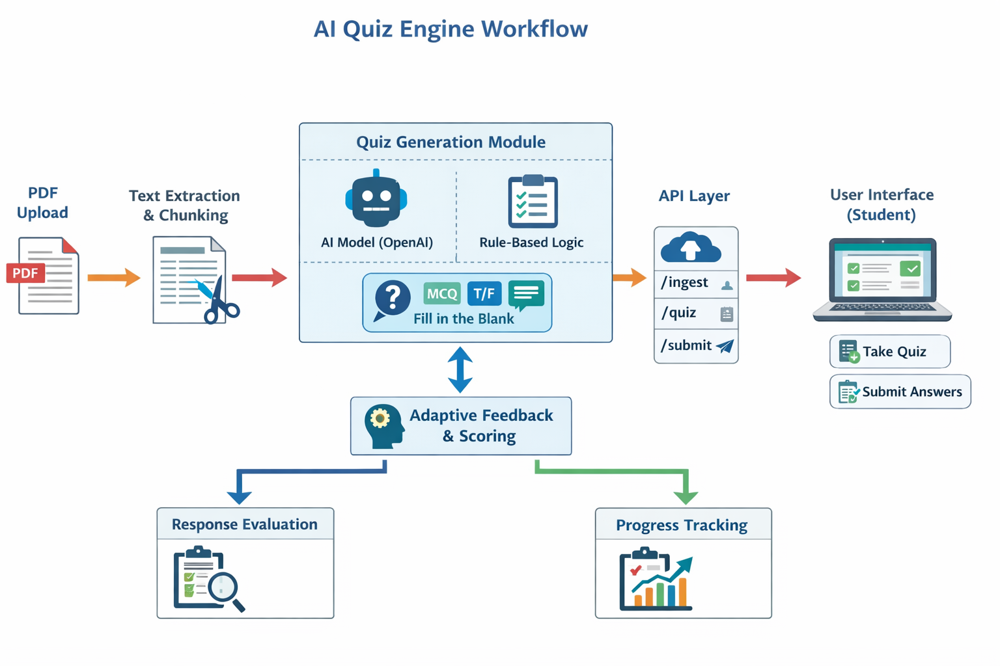

# AI Quiz Engine

An AI-powered backend system that automatically generates quizzes from uploaded PDF documents.  
The system extracts text from PDFs, generates quiz questions, and allows students to submit answers via REST APIs.

---

## 🚀 Features

- PDF content ingestion
- Automatic quiz generation
- Multiple question types (MCQ, True/False, Fill in the Blank)
- REST API endpoints
- Student answer submission
- Adaptive quiz evaluation
- SQLite database storage

---

## 🛠 Tech Stack

- Python
- FastAPI
- SQLite
- OpenAI API (optional)
- Uvicorn

---

## 📂 Project Structure

```
peblo_ai_quiz_engine_project
│
├── app
│   ├── main.py
│   ├── routes.py
│   ├── models.py
│   ├── quiz_generator.py
│   ├── database.py
│   └── utils.py
│
├── data
│   └── pdfs
│
├── quiz.db
├── requirements.txt
├── .env.example
└── README.md
```

---

# ⚙️ Setup Instructions

## 1️⃣ Clone the Repository

```bash
git clone https://github.com/your-username/peblo-ai-quiz-engine.git
cd peblo-ai-quiz-engine
```

---

## 2️⃣ Install Dependencies

Install required Python packages:

```bash
pip install -r requirements.txt
```

---

## 3️⃣ Configure Environment Variables

Create a `.env` file in the project root.

Example configuration:

```
OPENAI_API_KEY=your_api_key_here
DATABASE_URL=sqlite:///./quiz.db
```

If you do not want to use OpenAI, the project can run with the built-in rule-based quiz generator.

---

## 4️⃣ Run the Backend Server

Start the backend server using **Uvicorn**:

```bash
python -m uvicorn app.main:app --reload
```

Server will run at:

```
http://127.0.0.1:8000
```

Interactive API documentation:

```
http://127.0.0.1:8000/docs
```

---

# 🔗 API Endpoints

## 1. Upload PDF

```
POST /ingest
```

Uploads a PDF file and extracts text.

Example Request:

```
multipart/form-data
file: PDF file
```

Example Response:

```json
{
  "chunks_created": 5
}
```

---

## 2. Generate Quiz

```
POST /generate-quiz
```

Generates quiz questions from the ingested PDF content.

Example Response:

```json
{
  "generated": [...]
}
```

---

## 3. Get Quiz Questions

```
GET /quiz
```

Returns generated quiz questions.

Example Response:

```json
[
  {
    "id": 1,
    "question": "How many sides does a triangle have?",
    "options": ["2", "3", "4", "5"]
  }
]
```

---

## 4. Submit Answer

```
POST /submit-answer
```

Submit a student's answer.

Example Request Body:

```json
{
  "student_id": "S001",
  "question_id": 1,
  "selected_answer": "3"
}
```

Example Response:

```json
{
  "status": "received"
}
```

---

# 🧪 How to Test the APIs

Open API documentation:

```
http://127.0.0.1:8000/docs
```

Then run APIs in this order:

1. Upload a PDF using `/ingest`
2. Generate quiz questions using `/generate-quiz`
3. Fetch quiz questions using `/quiz`
4. Submit answers using `/submit-answer`

---

# 🏗 Architecture Overview

```
PDF Upload
    ↓
Text Extraction
    ↓
Text Chunking
    ↓
Database Storage
    ↓
Quiz Generation Engine
    ↓
REST API Layer
    ↓
Student Answer Submission
```

## Architecture Diagram

<p align="center">
  
</p>

---

# 🔮 Future Improvements

- Frontend quiz interface
- Adaptive difficulty system
- Student performance analytics
- Multiple subject support
- Advanced AI-based question generation

---

# 📜 License

This project is for educational and assessment purposes.
